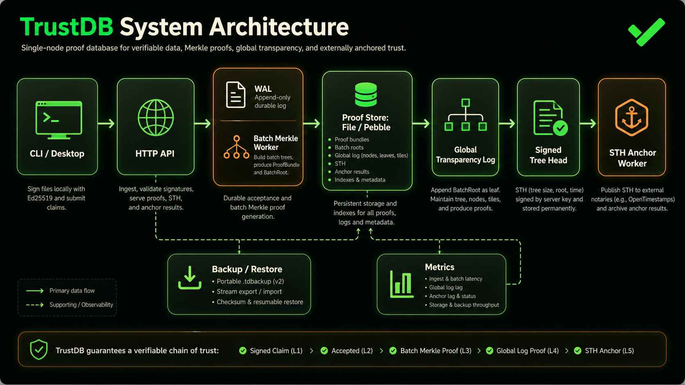
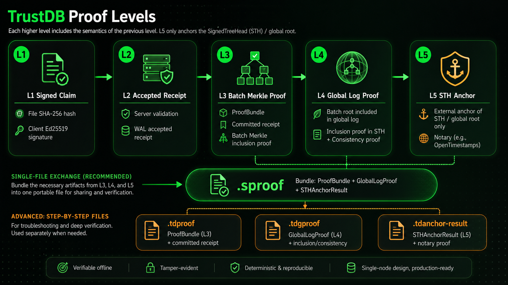

# TrustDB




TrustDB is a single-node verifiable evidence database. It turns local file claims into signed receipts, Merkle batch proofs, global transparency-log proofs, and optional external STH anchors.

Current repository module:

```text
github.com/ryan-wong-coder/trustdb
```

License: AGPL-3.0-only. See [LICENSE](LICENSE).

## Current Features

- Deterministic CBOR proof objects for claims, receipts, proof bundles, global-log proofs, STHs, anchors, and portable single-file proofs.
- Ed25519 client/server/registry signatures with key generation, key inspection, registry registration, revocation, and key listing commands.
- File claim creation with SHA-256 content hashing and optional local object-store copy.
- WAL-backed ingest path with configurable fsync mode: `strict`, `group`, or `batch`.
- HTTP ingest server with bounded queues, worker pool, health endpoint, Prometheus metrics, and graceful shutdown.
- Batch Merkle worker that emits `ProofBundle` data and server-side record indexes.
- Global Transparency Log that appends committed batch roots, persists STHs, and serves inclusion/consistency proofs.
- L5 anchor pipeline that anchors only `SignedTreeHead` / global roots, not per-batch roots.
- Anchor sinks for `off`, `noop`, local file output, and OpenTimestamps, with OTS upgrade worker support.
- Proofstore backends for local file storage and Pebble; the production profile uses Pebble.
- Paginated server-side record and root APIs with cursor/range-oriented access paths.
- Portable `.tdbackup` create, verify, and resumable restore flow.
- Desktop client built with Wails + Vue that supports onboarding, local identity, server settings, file attestation, record management, proof refresh, local verification, and `.sproof` export.
- Desktop local record storage backed by Pebble with indexes for list/search/filter paths.

## Proof Levels



TrustDB uses layered proof semantics:

| Level | Meaning | Main artifact |
| --- | --- | --- |
| L1 | Client signs a file claim containing content hash and metadata. | `SignedClaim` / `.tdclaim` |
| L2 | Server validates the claim and accepts it into WAL. | `AcceptedReceipt` |
| L3 | Claim is committed into a batch Merkle tree. | `ProofBundle` / `.tdproof` |
| L4 | The batch root is included in the Global Transparency Log and a target STH. | `GlobalLogProof` / `.tdgproof` |
| L5 | The corresponding STH/global root is externally anchored. | `STHAnchorResult` / `.tdanchor-result` |

For exchange and desktop verification, `.sproof` is the main single-file proof format. It can contain the L3 `ProofBundle`, optional L4 `GlobalLogProof`, and optional L5 `STHAnchorResult` together. The stable v1 format is documented in [formats/SPROOF_V1.md](formats/SPROOF_V1.md).

## Architecture

The current implementation is a single-node architecture with these main paths:

- Client path: CLI or desktop computes the file hash, signs a claim, and submits it to the HTTP server or local CLI flow.
- Ingest path: server validates signatures and key status, records durable acceptance in WAL, and returns an accepted receipt.
- Batch path: committed records are grouped into Merkle batches and stored as proof bundles plus record indexes.
- Global log path: committed batch roots are appended into a global transparency log, producing persisted STHs and global proofs.
- Anchor path: STH/global roots are queued and published by the anchor worker when an anchor sink is configured.
- Storage path: proof data is stored in file or Pebble proofstore backends; production config defaults to Pebble.
- Backup path: proofstore data can be exported to `.tdbackup`, verified, and restored with resume checkpoints.
- Observability path: `/metrics` exposes ingest, batch, global log, anchor, WAL, backup, and storage metrics.

## HTTP API

Implemented HTTP endpoints include:

| Endpoint | Purpose |
| --- | --- |
| `GET /healthz` | Health check. |
| `POST /v1/claims` | Submit a signed claim. |
| `GET /v1/records` | Paginated record list and search. |
| `GET /v1/records/{record_id}` | Read record index details. |
| `GET /v1/proofs/{record_id}` | Fetch L3 proof bundle. |
| `GET /v1/roots` | List batch roots. |
| `GET /v1/roots/latest` | Fetch latest batch root. |
| `GET /v1/sth/latest` | Fetch latest SignedTreeHead. |
| `GET /v1/sth/{tree_size}` | Fetch a specific STH. |
| `GET /v1/global-log/inclusion/{batch_id}` | Fetch global-log inclusion proof for a batch. |
| `GET /v1/global-log/consistency?from=&to=` | Fetch global-log consistency proof. |
| `GET /v1/anchors/sth/{tree_size}` | Fetch STH anchor status/result. |
| `GET /metrics` | Prometheus metrics. |

## CLI Quick Guide

Generate keys:

```powershell
go run ./cmd/trustdb keygen --out .trustdb-dev --prefix client
go run ./cmd/trustdb keygen --out .trustdb-dev --prefix server
```

Start a local development server with direct client public-key trust:

```powershell
go run ./cmd/trustdb serve `
  --config configs/development.yaml `
  --server-private-key .trustdb-dev/server.key `
  --client-public-key .trustdb-dev/client.pub `
  --listen 127.0.0.1:8080
```

Create and sign a file claim:

```powershell
go run ./cmd/trustdb claim-file `
  --file .\example.txt `
  --private-key .trustdb-dev/client.key `
  --tenant default `
  --client local-client `
  --key-id client-key `
  --out .trustdb-dev/example.tdclaim
```

Commit a signed claim locally into a proof bundle:

```powershell
go run ./cmd/trustdb commit `
  --claim .trustdb-dev/example.tdclaim `
  --server-private-key .trustdb-dev/server.key `
  --client-public-key .trustdb-dev/client.pub `
  --out .trustdb-dev/example.tdproof
```

Verify a local file and proof bundle:

```powershell
go run ./cmd/trustdb verify `
  --file .\example.txt `
  --proof .trustdb-dev/example.tdproof `
  --server-public-key .trustdb-dev/server.pub `
  --client-public-key .trustdb-dev/client.pub
```

Verify a local file with the recommended single-file proof:

```powershell
go run ./cmd/trustdb verify `
  --file .\example.txt `
  --sproof .trustdb-dev/example.sproof `
  --server-public-key .trustdb-dev/server.pub `
  --client-public-key .trustdb-dev/client.pub
```

Inspect Global Log data:

```powershell
go run ./cmd/trustdb global-log sth latest --metastore file --metastore-path .trustdb-dev/proofs
go run ./cmd/trustdb global-log proof inclusion --batch-id batch-000001 --metastore file --metastore-path .trustdb-dev/proofs
```

Create and verify a portable backup:

```powershell
go run ./cmd/trustdb backup create `
  --metastore file `
  --metastore-path .trustdb-dev/proofs `
  --out .trustdb-dev/trustdb.tdbackup

go run ./cmd/trustdb backup verify --file .trustdb-dev/trustdb.tdbackup
```

## Configuration

Two example profiles are included:

| File | Intended use |
| --- | --- |
| `configs/development.yaml` | Local development and demos. Uses file proofstore and `noop` anchor sink. |
| `configs/production.yaml` | Single-node production profile. Uses Pebble proofstore, directory WAL, group fsync, global log, and OTS anchor sink. |

Important configuration groups:

| Group | Purpose |
| --- | --- |
| `paths` | Data, key registry, WAL, object, and proof directories. |
| `metastore` / `metastore_path` | Proofstore backend selection: `file` or `pebble`. |
| `wal` | Fsync strategy and group-commit interval. |
| `server` | Listen address, queue size, workers, and timeouts. |
| `batch` | Batch queue, max records, and max delay. |
| `global_log` | Enables the global transparency log. |
| `anchor` | L5 anchor scope, sink, max delay, OTS calendars, and OTS upgrader. |
| `history` | Global-log tile size and hot window. |
| `backup` | Backup compression. |
| `log` | Structured logging, rotation, and async logging. |
| `keys` | Client, server, and registry key file paths. |

Most config values can also be overridden with `TRUSTDB_*` environment variables or command flags. Run `go run ./cmd/trustdb serve --help` for the currently implemented server flags.

## Desktop Client

The desktop app lives in `clients/desktop` and uses Wails + Vue. It currently supports:

- onboarding with local identity generation/import and server configuration;
- file attestation against a TrustDB HTTP server;
- paginated local record list, search, filters, details, deletion, and proof status refresh;
- `.sproof` as the primary export format;
- advanced export of `.tdproof`, `.tdgproof`, and `.tdanchor-result`;
- local proof verification, with optional L4/L5 artifacts;
- local record persistence in a Pebble-backed index store instead of one large JSON file.

Build checks used by this repository:

```powershell
cd clients/desktop
go test ./...
cd frontend
npm run build
```

## Development Checks

Pull requests run the GitHub Actions workflow in `.github/workflows/ci.yml`. It covers repository hygiene, backend unit/race/integration/e2e tests, desktop Go tests, and the desktop frontend build.

Common checks:

```powershell
go test ./...
go test -tags=integration ./...
go test -tags=e2e ./...
go test -race ./...
cd clients/desktop; go test ./...
cd clients/desktop/frontend; npm run build
```

The repository includes tests for deterministic CBOR, claims, WAL, batch proofs, global log proofs, anchors, backup/restore, HTTP API behavior, and desktop-local storage/verification paths.

## Contributing

TrustDB uses an Issue-first development flow. Before starting code, documentation, refactoring, or operations work, create or link a GitHub Issue with scope, acceptance criteria, and a test plan.

Use the GitHub Issue templates for bug reports, feature requests, and engineering tasks. Pull requests should use the repository PR template and must reference the linked Issue.

See [CONTRIBUTING.md](CONTRIBUTING.md) for the full contribution workflow, branch conventions, commit/PR expectations, CI quality gates, test matrix, documentation rules, and security notes.
