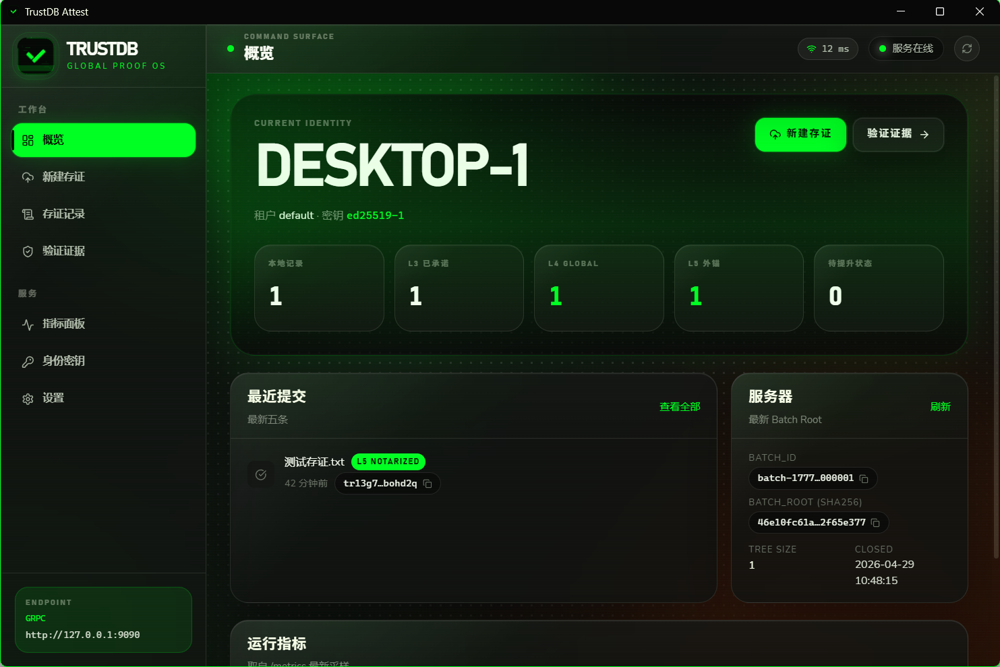

# TrustDB


[English README](README.md)


TrustDB 是一个单机可验证存证数据库。它把本地文件声明转换为可离线验证的签名收据、批次 Merkle 证明、Global Transparency Log 证明，以及可选的外部 STH 锚定结果。

当前 Go module：

```text
github.com/ryan-wong-coder/trustdb
```

许可证：AGPL-3.0-only，见 [LICENSE](LICENSE)。

## 桌面客户端



Wails + Vue 桌面客户端提供本地身份初始化、HTTP/gRPC 服务配置、文件存证、记录与证明管理、`.sproof` 导出和离线验证能力。

## 当前功能

- 使用确定性 CBOR 编码 claim、receipt、proof bundle、global-log proof、STH、anchor result 和 `.sproof` 单文件证明。
- 支持 Ed25519 客户端、服务端、registry 签名，以及 keygen、key inspect、registry register/revoke/list 等命令。
- 支持文件 claim 创建：计算 SHA-256 内容哈希，可选复制到本地 object store。
- WAL-backed ingest 路径，支持 `strict`、`group`、`batch` 三种 fsync 模式。
- HTTP ingest server：有界队列、worker pool、健康检查、Prometheus metrics、优雅关闭。
- 可选 gRPC server：面向 SDK 和服务间调用，使用 TrustDB CBOR payload 承载 unary gRPC 调用。
- Batch Merkle worker：生成 `ProofBundle` 和服务端 record index。
- Global Transparency Log：提交 batch root 后追加全局日志，持久化 STH，并提供 inclusion/consistency proof。
- L5 anchor pipeline：只锚定 `SignedTreeHead` / global root，不支持旧的 per-batch root 直锚。
- Anchor sink：`off`、`noop`、本地文件、OpenTimestamps，并支持 OTS upgrade worker。
- Proofstore：file 与 Pebble 两种后端；生产配置默认 Pebble。
- 分页 record/root API，服务端列表路径使用 cursor/range 访问方式。
- `.tdbackup` 备份创建、校验与可恢复 restore。
- Go SDK：提供 claim 签名、服务端访问、证明导出、离线验证能力。
- Wails + Vue 桌面客户端：支持初始化向导、本地身份、服务端配置、文件存证、记录管理、证明刷新、离线验证与 `.sproof` 导出。
- 桌面客户端本地 records 使用 Pebble-backed index store，不再使用单个 JSON 文件承载全部记录。

## 证明等级


TrustDB 使用分层证明语义：

| 等级 | 含义 | 主要产物 |
| --- | --- | --- |
| L1 | 客户端对包含文件哈希和元数据的 claim 签名。 | `SignedClaim` / `.tdclaim` |
| L2 | 服务端校验 claim，并接受进入 WAL。 | `AcceptedReceipt` |
| L3 | claim 被提交到 batch Merkle tree。 | `ProofBundle` / `.tdproof` |
| L4 | batch root 已进入 Global Transparency Log，并能证明其包含在某个 STH 中。 | `GlobalLogProof` / `.tdgproof` |
| L5 | 对应 STH/global root 已被外部 anchor sink 锚定。 | `STHAnchorResult` / `.tdanchor-result` |

桌面客户端和交换场景推荐使用 `.sproof` 单文件证明。`.sproof` 可以同时包含 L3 `ProofBundle`、可选 L4 `GlobalLogProof`、可选 L5 `STHAnchorResult`。稳定 v1 格式见 [formats/SPROOF_V1.md](formats/SPROOF_V1.md)。

## 架构设计

当前实现是单机架构，主要路径如下：

- 客户端路径：CLI 或桌面客户端计算文件哈希，签名 claim，通过 HTTP server 或本地 CLI 流程提交。
- Ingest 路径：服务端校验签名和 key 状态，写入 WAL，返回 accepted receipt。
- Batch 路径：已接受记录被 batch worker 聚合为 Merkle batch，并存储 proof bundle 与 record index。
- Global Log 路径：已提交 batch root 被追加到 global transparency log，生成持久化 STH 与 global proof。
- Anchor 路径：STH/global root 入队，由 anchor worker 按配置发布到 anchor sink。
- Storage 路径：proof 数据落到 file 或 Pebble proofstore；生产配置默认 Pebble。
- Backup 路径：proofstore 数据可导出为 `.tdbackup`，支持 verify 与带 checkpoint 的 restore。
- Observability 路径：`/metrics` 暴露 ingest、batch、global log、anchor、WAL、backup、storage 等指标。

## HTTP API

已实现的 HTTP endpoint：

| Endpoint | 用途 |
| --- | --- |
| `GET /healthz` | 健康检查。 |
| `POST /v1/claims` | 提交签名 claim。 |
| `GET /v1/records` | 分页 record 列表与搜索。 |
| `GET /v1/records/{record_id}` | 读取 record index 详情。 |
| `GET /v1/proofs/{record_id}` | 获取 L3 proof bundle。 |
| `GET /v1/roots` | 列出 batch roots。 |
| `GET /v1/roots/latest` | 获取最新 batch root。 |
| `GET /v1/sth/latest` | 获取最新 SignedTreeHead。 |
| `GET /v1/sth/{tree_size}` | 获取指定 tree size 的 STH。 |
| `GET /v1/global-log/inclusion/{batch_id}` | 获取 batch 的 global-log inclusion proof。 |
| `GET /v1/global-log/consistency?from=&to=` | 获取 global-log consistency proof。 |
| `GET /v1/anchors/sth/{tree_size}` | 获取 STH anchor 状态或结果。 |
| `GET /metrics` | Prometheus metrics。 |

## gRPC API

服务端可以通过 `--grpc-listen` 或 `server.grpc_listen` 额外暴露 gRPC listener。第一阶段实现继续复用 TrustDB 现有确定性 CBOR 模型作为 gRPC payload codec，因此 SDK 调用方可以在 HTTP 和 gRPC transport 之间切换，而不会改变 proof object 语义。

当前 gRPC service 覆盖桌面客户端和 SDK 已使用的核心路径：health、submit claim、record list/detail、proof bundle、roots/latest root、STH、global proof、anchor state 和 metrics。同时注册标准 `grpc.health.v1.Health` 服务，便于基础设施探活。

## 快速向导

生成客户端和服务端密钥：

```powershell
go run ./cmd/trustdb keygen --out .trustdb-dev --prefix client
go run ./cmd/trustdb keygen --out .trustdb-dev --prefix server
```

用直接信任客户端公钥的方式启动本地开发服务：

```powershell
go run ./cmd/trustdb serve `
  --config configs/development.yaml `
  --server-private-key .trustdb-dev/server.key `
  --client-public-key .trustdb-dev/client.pub `
  --listen 127.0.0.1:8080
```

创建并签名一个文件 claim：

```powershell
go run ./cmd/trustdb claim-file `
  --file .\example.txt `
  --private-key .trustdb-dev/client.key `
  --tenant default `
  --client local-client `
  --key-id client-key `
  --out .trustdb-dev/example.tdclaim
```

把签名 claim 本地提交为 proof bundle：

```powershell
go run ./cmd/trustdb commit `
  --claim .trustdb-dev/example.tdclaim `
  --server-private-key .trustdb-dev/server.key `
  --client-public-key .trustdb-dev/client.pub `
  --out .trustdb-dev/example.tdproof
```

验证本地文件和 proof bundle：

```powershell
go run ./cmd/trustdb verify `
  --file .\example.txt `
  --proof .trustdb-dev/example.tdproof `
  --server-public-key .trustdb-dev/server.pub `
  --client-public-key .trustdb-dev/client.pub
```

使用推荐的 `.sproof` 单文件证明验证：

```powershell
go run ./cmd/trustdb verify `
  --file .\example.txt `
  --sproof .trustdb-dev/example.sproof `
  --server-public-key .trustdb-dev/server.pub `
  --client-public-key .trustdb-dev/client.pub
```

查看 Global Log 数据：

```powershell
go run ./cmd/trustdb global-log sth latest --metastore file --metastore-path .trustdb-dev/proofs
go run ./cmd/trustdb global-log proof inclusion --batch-id batch-000001 --metastore file --metastore-path .trustdb-dev/proofs
```

创建并校验便携备份：

```powershell
go run ./cmd/trustdb backup create `
  --metastore file `
  --metastore-path .trustdb-dev/proofs `
  --out .trustdb-dev/trustdb.tdbackup

go run ./cmd/trustdb backup verify --file .trustdb-dev/trustdb.tdbackup
```

## 配置

仓库内包含两个示例配置：

| 文件 | 用途 |
| --- | --- |
| `configs/development.yaml` | 本地开发与演示。使用 file proofstore 和 `noop` anchor sink。 |
| `configs/production.yaml` | 单机生产配置。使用 Pebble proofstore、directory WAL、group fsync、global log 和 OTS anchor sink。 |

主要配置组：

| 配置组 | 作用 |
| --- | --- |
| `paths` | 数据、key registry、WAL、object、proof 目录。 |
| `metastore` / `metastore_path` | Proofstore 后端：`file` 或 `pebble`。 |
| `wal` | Fsync 策略与 group commit interval。 |
| `server` | HTTP 监听地址、可选 gRPC 监听地址、队列大小、worker 数量和 timeout。 |
| `batch` | Batch 队列、最大记录数、最大延迟。 |
| `global_log` | 是否启用 global transparency log。 |
| `anchor` | L5 anchor scope、sink、max delay、OTS calendars、OTS upgrader。 |
| `history` | Global-log tile size 与 hot window。 |
| `backup` | 备份压缩方式。 |
| `log` | 结构化日志、轮转与异步日志。 |
| `keys` | 客户端、服务端、registry key 文件路径。 |

大多数配置可以通过 `TRUSTDB_*` 环境变量或命令行 flag 覆盖。运行 `go run ./cmd/trustdb serve --help` 查看当前已实现的服务端参数。

## 桌面客户端

桌面客户端位于 `clients/desktop`，使用 Wails + Vue。当前支持：

- 初始化向导：本地身份生成/导入、服务端地址与公钥配置；
- 向 TrustDB HTTP server 发起文件存证；
- 本地 record 分页列表、搜索、筛选、详情、删除和 proof 状态刷新；
- `.sproof` 作为主要导出格式；
- 高级导出 `.tdproof`、`.tdgproof`、`.tdanchor-result`；
- 本地离线验证，可选 L4/L5 artifacts；
- 本地 records 持久化到 Pebble-backed index store。

桌面端常用检查：

```powershell
cd clients/desktop
go test ./...
cd frontend
npm run build
```

## Go SDK

Go SDK 位于 `sdk`，导入路径：

```go
import "github.com/ryan-wong-coder/trustdb/sdk"
```

当前 SDK 能力：

- 构造并签名文件 claim；
- 提交 signed claim 到 `POST /v1/claims`；
- 查询 records、proof bundles、STH、GlobalLogProof、STH anchor state；
- 默认使用 HTTP transport，也可以通过 `sdk.NewGRPCClient` 使用 gRPC transport；
- 导出推荐的 `.sproof` 单文件证明；
- 本地验证 `.sproof` 或拆分 proof artifacts；
- 读取 health、batch roots 和 Prometheus metrics，供客户端复用服务端访问逻辑。

最小示例：

```go
client, err := sdk.NewClient("http://127.0.0.1:8080")
if err != nil {
    return err
}
proof, err := client.ExportSingleProof(ctx, recordID)
if err != nil {
    return err
}
return sdk.WriteSingleProofFile("example.sproof", proof)
```

如果要使用 gRPC transport：

```go
client, err := sdk.NewGRPCClient("127.0.0.1:9090")
```

## 开发检查

PR 会运行 `.github/workflows/ci.yml` 中的 GitHub Actions，包括仓库卫生检查、后端 unit/race/integration/e2e tests、桌面端 Go tests 和桌面前端 build。

常用检查：

```powershell
go test ./...
go test -tags=integration ./...
go test -tags=e2e ./...
go test -race ./...
cd clients/desktop; go test ./...
cd clients/desktop/frontend; npm run build
```

当前测试覆盖 deterministic CBOR、claims、WAL、batch proofs、global log proofs、anchors、backup/restore、HTTP API、桌面端本地存储和验证路径。

## 贡献方式

TrustDB 使用 Issue-first 开发流程。开始代码、文档、重构或运维工作前，需要创建或关联 GitHub Issue，并写清范围、验收标准和测试计划。

Bug、功能和工程任务请使用仓库 Issue 模板。PR 应使用仓库 PR 模板，并引用关联 Issue。

完整贡献流程、分支约定、commit/PR 要求、CI 质量门、测试矩阵、文档规则与安全注意事项见 [CONTRIBUTING.md](CONTRIBUTING.md)。
