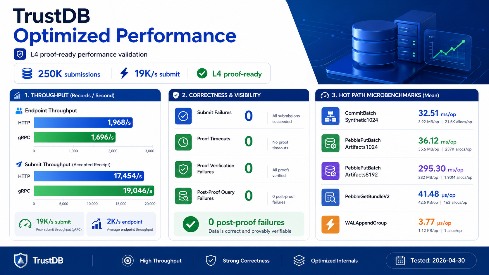
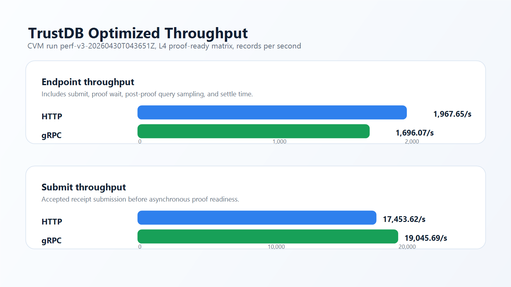
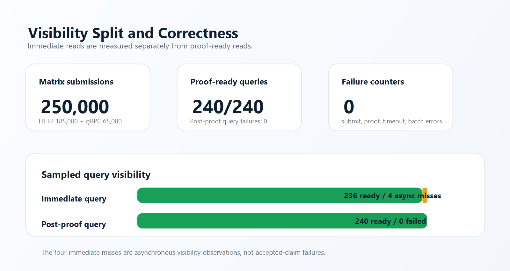
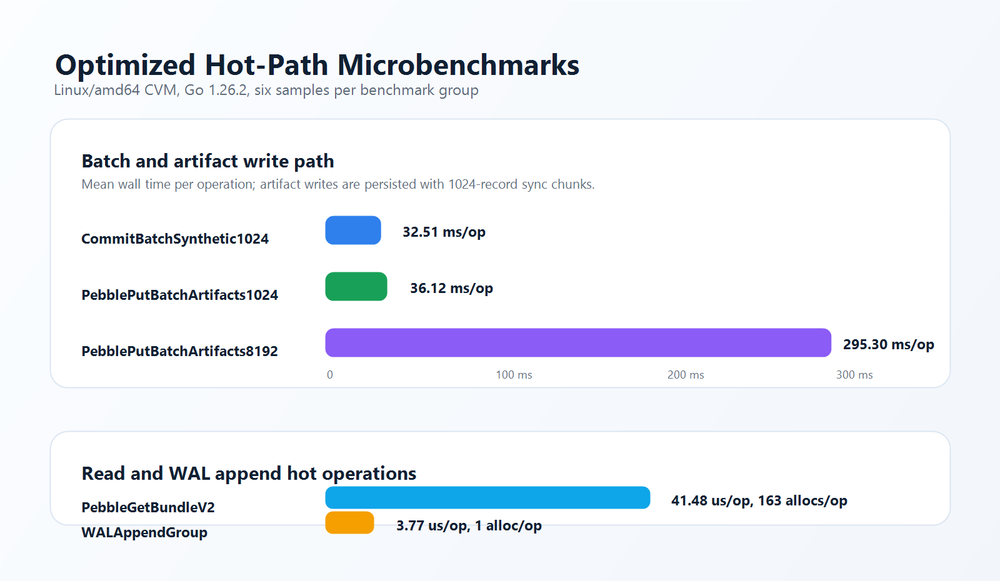

# TrustDB 优化后单机性能测试报告



报告日期：2026-04-30  
测试 Run ID：`perf-v3-20260430T043651Z`  
代码范围：bench v3、Merkle proof、Pebble proof artifact、WAL 可观测性、SDK HTTP transport 优化后分支  
核心目标：验证当前单机写入性能，并把“提交成功”“立即查询可见”“等待 proof 后查询成功”拆成独立指标。

上图是 AI 生成的报告概览视觉图。下方表格和指标图来自本轮测试产物与 benchmark 输出，是本报告的数据依据。

## 结论摘要

优化后的 TrustDB 在本轮 CVM matrix 测试中没有出现提交失败、batch 错误、proof 失败、proof timeout 或等待 proof 后查询失败。

| 指标 | HTTP matrix | gRPC matrix | 合计 |
| --- | ---: | ---: | ---: |
| 提交记录数 | 185,000 | 65,000 | 250,000 |
| 提交失败 | 0 | 0 | 0 |
| Batch 错误 | 0 | 0 | 0 |
| Proof timeout | 0 | 0 | 0 |
| Proof 失败 | 0 | 0 | 0 |
| 等待 proof 后查询失败 | 0 | 0 | 0 |
| 立即查询未命中 | 2 / 160 samples | 2 / 80 samples | 4 / 240 samples |

这 4 次立即查询未命中不是业务提交失败，而是异步可见性现象：记录已经被 L2 接受，但在立即读取采样点，L3/L4 proof 与 record index 尚未全部完成。等待 proof ready 后，所有采样记录都可以正常读取。



## 测试环境

| 项目 | 配置 |
| --- | --- |
| 云主机 | 腾讯云 CVM |
| 地域 / 可用区 | 南京 / 南京一区 |
| 实例规格 | `SA5.8XLARGE64` |
| CPU / 内存 | 32 vCPU / 64 GiB |
| 系统镜像 | TencentOS Server 4 for x86_64 |
| 系统盘 | 100 GiB 增强型 SSD 云硬盘 |
| 数据盘 | 未挂载 |
| TrustDB 服务 | `trustdb-perf.service`，状态 active |
| 健康检查 | `{"ok":true}` |
| 本轮运行目录大小 | 1.9 GiB |
| 微基准 Go 版本 | Go 1.26.2 linux/amd64 |
| benchmark 识别 CPU | AMD EPYC 9754 128-Core Processor |

本报告不记录服务器密码、密钥或敏感访问凭据。

## 测试口径

Bench report 使用 `trustdb.bench.ingest.v3`。

| 指标 | 含义 |
| --- | --- |
| `submit_duration_seconds` / `submit_throughput_per_sec` | 接收 signed claim 并返回 accepted receipt 的提交路径，不等待异步 proof ready。 |
| `immediate_query_samples` | 提交后立刻执行 `GetRecord` 的采样结果，用于观察异步可见性延迟。 |
| `proof_wait_duration_seconds` / `proof_samples` | 等待指定 proof 目标，本轮为 L4。 |
| `post_proof_query_samples` | proof ready 后再次执行 `GetRecord` 的采样结果，这是 proof-ready 查询正确性的主要信号。 |
| `throughput_per_sec` | 兼容旧报告的端到端吞吐字段，包含提交、等待 proof、查询采样和 settle 时间。 |

拆分这些口径后，报告不会再把“异步 proof 尚未完成”误读成“业务提交失败”。



## Matrix 测试结果

### HTTP

| Case | 记录数 | 并发 | Payload | 端到端吞吐 | 提交吞吐 | 提交 p95 | 立即查询未命中 | Proof 后查询失败 |
| --- | ---: | ---: | ---: | ---: | ---: | ---: | ---: | ---: |
| `p1k-c8` | 10,000 | 8 | 1 KiB | 2,485.09/s | 10,088.53/s | 5 ms | 0 | 0 |
| `p1k-c16` | 20,000 | 16 | 1 KiB | 4,340.70/s | 12,779.60/s | 5 ms | 0 | 0 |
| `p1k-c32` | 30,000 | 32 | 1 KiB | 2,735.06/s | 14,728.02/s | 10 ms | 0 | 0 |
| `p1k-c64` | 30,000 | 64 | 1 KiB | 1,488.97/s | 19,570.34/s | 10 ms | 1 | 0 |
| `p1k-c128` | 30,000 | 128 | 1 KiB | 1,600.20/s | 26,237.86/s | 10 ms | 0 | 0 |
| `p4k-c32` | 20,000 | 32 | 4 KiB | 1,636.06/s | 16,403.38/s | 5 ms | 0 | 0 |
| `p4k-c64` | 20,000 | 64 | 4 KiB | 1,829.18/s | 20,121.75/s | 10 ms | 0 | 0 |
| `p16k-c32` | 10,000 | 32 | 16 KiB | 898.30/s | 16,496.42/s | 5 ms | 0 | 0 |
| `p16k-c64` | 10,000 | 64 | 16 KiB | 1,984.24/s | 21,055.81/s | 10 ms | 0 | 0 |
| `p64k-c32` | 5,000 | 32 | 64 KiB | 678.74/s | 17,054.48/s | 5 ms | 1 | 0 |

HTTP 汇总：

| 指标 | 数值 |
| --- | ---: |
| 平均端到端吞吐 | 1,967.65/s |
| 平均提交吞吐 | 17,453.62/s |
| 最快端到端 case | `p1k-c16`，4,340.70/s |
| 最快提交 case | `p1k-c128`，26,237.86/s |
| 最慢提交 p95 | 10 ms |

### gRPC

| Case | 记录数 | 并发 | Payload | 端到端吞吐 | 提交吞吐 | 提交 p95 | 立即查询未命中 | Proof 后查询失败 |
| --- | ---: | ---: | ---: | ---: | ---: | ---: | ---: | ---: |
| `p1k-c16` | 10,000 | 16 | 1 KiB | 2,708.57/s | 15,120.64/s | 5 ms | 0 | 0 |
| `p1k-c32` | 20,000 | 32 | 1 KiB | 2,537.51/s | 18,641.82/s | 5 ms | 0 | 0 |
| `p1k-c64` | 20,000 | 64 | 1 KiB | 1,272.46/s | 24,294.90/s | 10 ms | 1 | 0 |
| `p4k-c32` | 10,000 | 32 | 4 KiB | 887.78/s | 19,521.52/s | 5 ms | 0 | 0 |
| `p16k-c32` | 5,000 | 32 | 16 KiB | 1,074.05/s | 17,649.55/s | 5 ms | 1 | 0 |

gRPC 汇总：

| 指标 | 数值 |
| --- | ---: |
| 平均端到端吞吐 | 1,696.07/s |
| 平均提交吞吐 | 19,045.69/s |
| 最快端到端 case | `p1k-c16`，2,708.57/s |
| 最快提交 case | `p1k-c64`，24,294.90/s |
| 最慢提交 p95 | 10 ms |

## 热路径微基准



| Benchmark | 平均耗时 | 平均 B/op | 平均 allocs/op |
| --- | ---: | ---: | ---: |
| `BenchmarkCommitBatchSynthetic1024` | 32.51 ms/op | 3.92 MB/op | 21,526 |
| `BenchmarkPebblePutBatchArtifacts1024` | 36.12 ms/op | 35.48 MB/op | 237,146 |
| `BenchmarkPebblePutBatchArtifacts8192` | 295.30 ms/op | 282.19 MB/op | 1,895,782 |
| `BenchmarkPebbleGetBundleV2` | 41.48 us/op | 41.63 KiB/op | 163 |
| `BenchmarkWALAppendGroup` | 3.77 us/op | 1,152 B/op | 1 |

当前实现保持了 WAL group append 的低开销，同时没有改变默认持久化边界。剩余最明显的内存压力仍集中在 proof artifact 持久化，尤其是大 batch 的 bundle/index 编码与落盘路径。

## 当前性能解读

在本次 CVM 规格下，TrustDB 当前已经可以稳定完成单机 proof-ready ingest 测试：

- HTTP/gRPC 的平均提交吞吐约 17K 到 19K records/s。
- 端到端 proof-ready 吞吐低于纯提交吞吐，这是预期现象，因为它额外包含 proof wait、record 查询校验和 settle 时间。
- 所有采样记录都成功达到 L4 proof ready，没有 proof timeout。
- Proof ready 后的 record 查询全部成功，这是异步证明架构下最关键的正确性信号。
- 各 matrix case 的提交 p95 在 5 ms 到 10 ms 之间。

这轮报告最重要的变化是：立即查询未命中被单独归类为异步可见性，而不是被混入通用查询失败或提交失败。

## 已验证的优化点

本轮测试覆盖并验证了以下优化：

- Bench schema v3 拆分 immediate visibility 与 post-proof visibility。
- Merkle proof 生成避免重复递归计算，并支持 batch proof 生成。
- Pebble proof artifact 使用 v2 压缩 envelope，同时保留 legacy bundle 读取兼容。
- Pebble batch artifact 写入按 1024 条记录 chunk sync commit，并复用编码路径。
- 二级 record index 使用 compact reference，旧格式仍可读取。
- WAL append/fsync 指标接入 writer 路径，不改变默认 group fsync 语义。
- SDK 与 benchmark HTTP transport 默认连接池更适合高并发压测，同时保留 `WithHTTPClient` 自定义能力。
- Batch stage metrics 覆盖 collect、build、artifacts、checkpoint、manifest 与 outbox 边界。

## 后续风险与建议

当前测试主机没有独立数据盘。WAL、Pebble WAL、table flush、proof artifact 与 compaction 都共用 100 GiB 系统盘。若后续要做更长时间、更高压力或更接近生产 SLO 的测试，建议把 WAL 与 Pebble 数据目录放到独立高性能数据盘。

软件侧下一步优先优化 `PutBatchArtifacts` 的内存占用，尤其是大 batch 的 bundle/index 编码。第二个关注点是大 payload 下的 proof-ready 延迟，本轮 HTTP `p64k-c32` 的 proof wait 平均值为 253.82 ms，单个采样记录最长等待约 4.04 秒才达到 proof-ready。

## 验证命令

优化分支已通过：

```powershell
go test -p 1 ./...
go test -p 1 -tags=e2e ./cmd/trustdb
go test -race -tags='integration e2e' ./...
```

远端微基准命令：

```bash
go test -run '^$' -bench 'BenchmarkCommitBatchSynthetic1024' -benchmem -count=6 ./internal/app
go test -run '^$' -bench 'BenchmarkPebblePutBatchArtifacts1024|BenchmarkPebblePutBatchArtifacts8192|BenchmarkPebbleGetBundleV2' -benchmem -count=6 ./internal/proofstore/pebble
go test -run '^$' -bench 'BenchmarkWALAppendGroup' -benchmem -count=6 ./internal/wal
```

本地保留的主要测试产物目录：

```text
.localdeploy/perf-v3-20260430T043651Z/reports/
```

